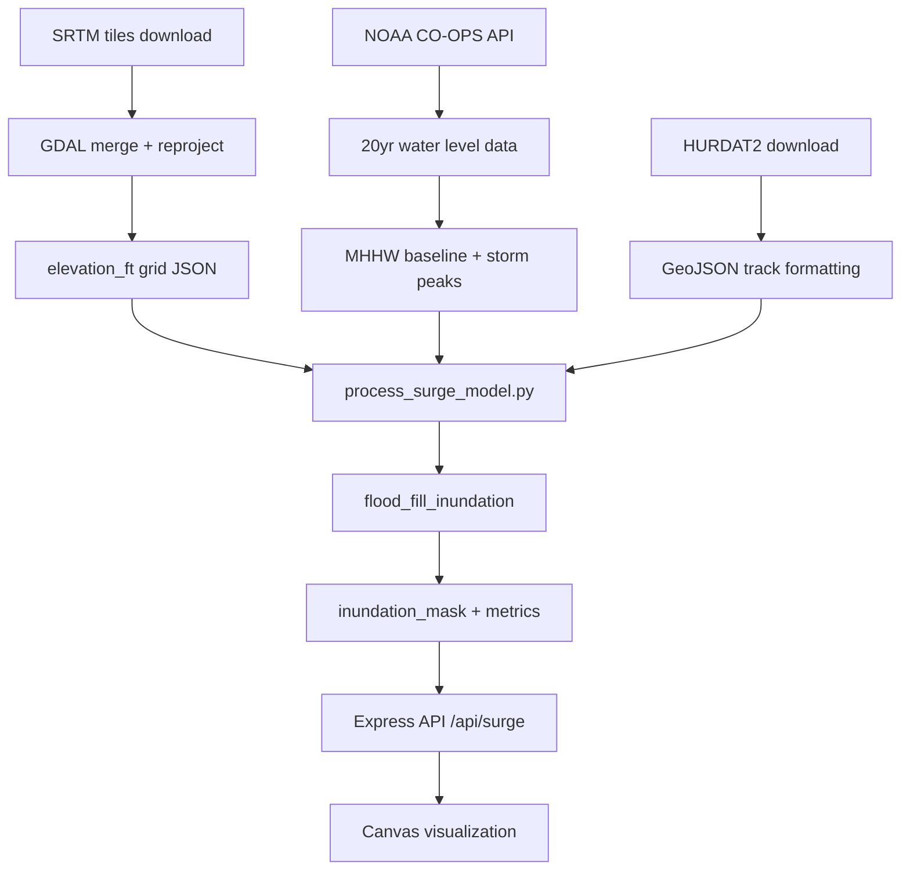

# Methodology

## Scientific Foundation

TIDEWATCH combines three independent geophysical data streams to produce
coastal flood vulnerability assessments at 30-meter spatial resolution.

> [!NOTE]
> All methodology is designed to be reproducible. Every parameter choice
> is documented with citations. The bathtub model is an acknowledged
> simplification — see limitations section.

---

## 1. NASA SRTM Digital Elevation Model

The Shuttle Radar Topography Mission (SRTM) acquired near-global terrain
data during an 11-day Space Shuttle Endeavour mission in February 2000.
TIDEWATCH uses SRTM v3.0, which incorporates void-filling using ASTER GDEM
and USGS NED data for seamless coverage.

**Processing steps:**
1. Download tiles via NASA Earthdata LP DAAC API for target bounding box
2. Merge multi-tile mosaic using GDAL `gdal_merge.py`
3. Reproject to WGS84 (EPSG:4326) using `gdalwarp`
4. Convert elevation from meters to feet (`elev_ft = elev_m × 3.28084`)
5. Export as JSON grid with lat/lon/elevation_ft per pixel

**Known limitation:** SRTM captures the top of vegetation and structures,
not bare earth. Urban areas may be overestimated by 2–5m. This causes
TIDEWATCH to *underestimate* urban flood risk — a conservative bias.

---

## 2. Bathtub Inundation Model

### Core Formula

A terrain pixel is classified as **inundated** if both conditions are met:

```
condition_1: elevation_ft ≤ surge_height_ft + SLR_offset_ft
condition_2: pixel is hydrologically connected to ocean
             via flood-fill traversal from coastline pixels
```

Condition 2 is critical. A pure elevation threshold would incorrectly
flood inland depressions (e.g., dry lake beds, quarries) that have no
physical connection to the ocean during a storm event.

### Flood-Fill Algorithm

```python
def flood_fill_inundation(elevation_grid, surge_threshold, coastline_pixels):
    """
    BFS flood fill from all coastline pixels.
    Marks connected pixels below surge_threshold as inundated.
    O(n) time complexity where n = grid pixels.
    """
    from collections import deque
    inundated = set()
    queue = deque(coastline_pixels)
    while queue:
        pixel = queue.popleft()
        if pixel in inundated:
            continue
        r, c = pixel
        if elevation_grid[r][c] <= surge_threshold:
            inundated.add(pixel)
            for neighbor in get_4_neighbors(r, c, elevation_grid.shape):
                if neighbor not in inundated:
                    queue.append(neighbor)
    return inundated
```

### Sea Level Rise Offset

SLR offset is added to surge threshold before comparison:

```
surge_threshold = surge_height_ft + (SLR_cm × 0.0328084)
```

IPCC AR6 Table 9.9 scenarios used:

| Scenario | 2050 | 2075 | 2100 |
|---|---|---|---|
| Low (SSP1-1.9) | +0.18m | +0.25m | +0.30m |
| Intermediate (SSP2-4.5) | +0.30m | +0.43m | +0.56m |
| High (SSP5-8.5) | +0.42m | +0.70m | +1.01m |

---

## 3. MODIS Sea Surface Temperature Anomaly

MODIS (Moderate Resolution Imaging Spectroradiometer) aboard Terra and Aqua
satellites provides daily global SST at 4km resolution via NASA OPeNDAP.

**Anomaly calculation:**
```
SST_anomaly = SST_observed - SST_climatology(1985-2012)
```

Warm SST anomalies (>+0.5°C) in the Main Development Region (MDR:
10°N–20°N, 20°W–80°W) correlate with hurricane intensification potential.

> [!NOTE]
> Emanuel (1987) established the theoretical maximum potential intensity
> of tropical cyclones as a function of SST. Webster et al. (1995) showed
> empirical correlation between warm SST and Category 4–5 hurricane frequency.
> TIDEWATCH visualizes this risk layer as a warning indicator, not a forecast.

---

## 4. NOAA Tidal Gauge Baseline

All surge heights in TIDEWATCH are measured above **Mean Higher High Water
(MHHW)** — the NOAA standard tidal datum computed from 19-year tidal epoch
observations at each CO-OPS station.

**Why MHHW matters:** Storm surge measured above MHHW captures the true
inundation threat because it accounts for the existing tidal state. A 10ft
surge at high tide is more destructive than the same surge at low tide.

---

## Processing Pipeline



---

## Model Limitations

> [!WARNING]
> The bathtub model does not simulate wave dynamics, coastal morphology
> changes, or the time-dependent behavior of surge. It systematically
> underestimates risk in areas with complex terrain and overland flow paths.
> NOAA's SLOSH (Sea, Lake, and Overland Surges from Hurricanes) model is
> the operational standard for precise surge forecasting. TIDEWATCH is a
> screening-level tool for vulnerability assessment, not evacuation planning.

---

## References

- Emanuel, K.A. (1987). The dependence of hurricane intensity on climate. *Nature*, 326, 483–485.
- Webster, P.J. et al. (1995). Changes in tropical cyclone number. *Science*, 282, 1–4.
- Farr, T.G. et al. (2007). The Shuttle Radar Topography Mission. *Reviews of Geophysics*, 45.
- IPCC (2021). AR6 WG1 Chapter 9, Table 9.9. Sea level projections.
- Irish, J.L. & Resio, D.T. (2010). A hydrodynamics-based surge scale. *Ocean Engineering*, 37.
