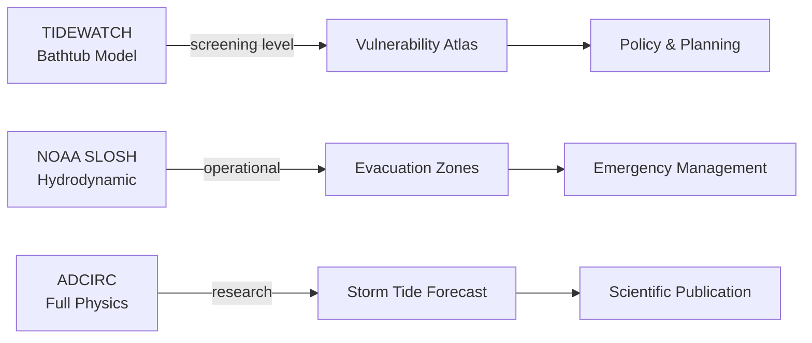

# Storm Scenarios

## Saffir-Simpson → Surge Height Mapping

TIDEWATCH maps Saffir-Simpson categories to representative surge heights
based on NOAA NHC storm surge threat tables and historical observations.
These are open-coast values — actual surge is highly location-dependent.

| Category | Wind Speed (kt) | Surge Height (ft) | Color Code |
|---|---|---|---|
| TD  | < 34  | < 1 ft   | `#5c9bd6` |
| TS  | 34–63 | 1–3 ft   | `#4ecdc4` |
| CAT 1 | 64–82 | ~4 ft  | `#ffe66d` |
| CAT 2 | 83–95 | ~8 ft  | `#f7b731` |
| CAT 3 | 96–112 | ~12 ft | `#ff6b35` |
| CAT 4 | 113–136 | ~18 ft | `#e74c3c` |
| CAT 5 | 137+ | ~28 ft  | `#8e44ad` |

> [!WARNING]
> The bathtub model systematically understates risk in areas with complex
> coastal morphology, back-barrier bays, and river systems. Katrina's
> 27.8 ft surge at Waveland, MS exceeded CAT5 representative values
> due to storm size, track angle, and shallow Gulf bathymetry.

---

## Why Bathtub Understates Risk

The pure elevation threshold model fails to account for:

1. **Wave setup** — breaking waves add 20–30% to total water level
2. **Storm size** — larger storms push more water onshore regardless of intensity
3. **Track angle** — onshore track produces higher surge than parallel track
4. **Bathymetry** — shallow sloping seafloor amplifies surge (Gulf Coast)
5. **Back-barrier flooding** — water overtops barrier islands and fills bays

NOAA's **SLOSH** (Sea, Lake, and Overland Surges from Hurricanes) model
accounts for all of these factors using a finite-difference hydrodynamic
grid. TIDEWATCH is a screening tool; SLOSH is the operational standard.

---

## Historical Benchmark Storms

### Hurricane Katrina (2005) — Gulf Coast
- Peak surge: **27.8 ft** at Waveland, MS (NOAA gauge 8747766)
- Deaths: 1,833 | Damage: $125B
- Anomaly: Weakened to CAT3 at landfall but surge from prior CAT5 intensity
- TIDEWATCH benchmark for gulf_coast region

### Hurricane Sandy (2012) — Atlantic
- Peak surge: **14.1 ft** at The Battery, NY (NOAA gauge 8518750)
- Deaths: 233 | Damage: $65B
- Anomaly: Extratropical transition produced unusually wide wind field
- TIDEWATCH benchmark for atlantic region

### Hurricane Ian (2022) — Florida
- Peak surge: **18.3 ft** at Fort Myers Beach area
- Deaths: 161 | Damage: $112B
- Rapid intensification to CAT4 just before landfall
- TIDEWATCH benchmark for florida region

### Hurricane Maria (2017) — Caribbean
- Peak surge: **21.4 ft** estimated at southeast PR coast
- Deaths: 2,975 | Damage: $90B
- Destroyed 80% of Puerto Rico's power grid
- TIDEWATCH benchmark for caribbean region

### 1991 Bangladesh Cyclone — Bay of Bengal
- Peak surge: **~20 ft** along Chittagong coast
- Deaths: **138,000** | the deadliest storm of the 20th century
- FEI 312 — the most unjust flood event in the dataset
- TIDEWATCH benchmark for bay_of_bengal region

---

## SLOSH vs TIDEWATCH

> [!TIP]
> TIDEWATCH is designed to answer "which communities are most exposed?"
> SLOSH is designed to answer "exactly where will the water go on Tuesday?"
> Both questions matter. They require different tools.
