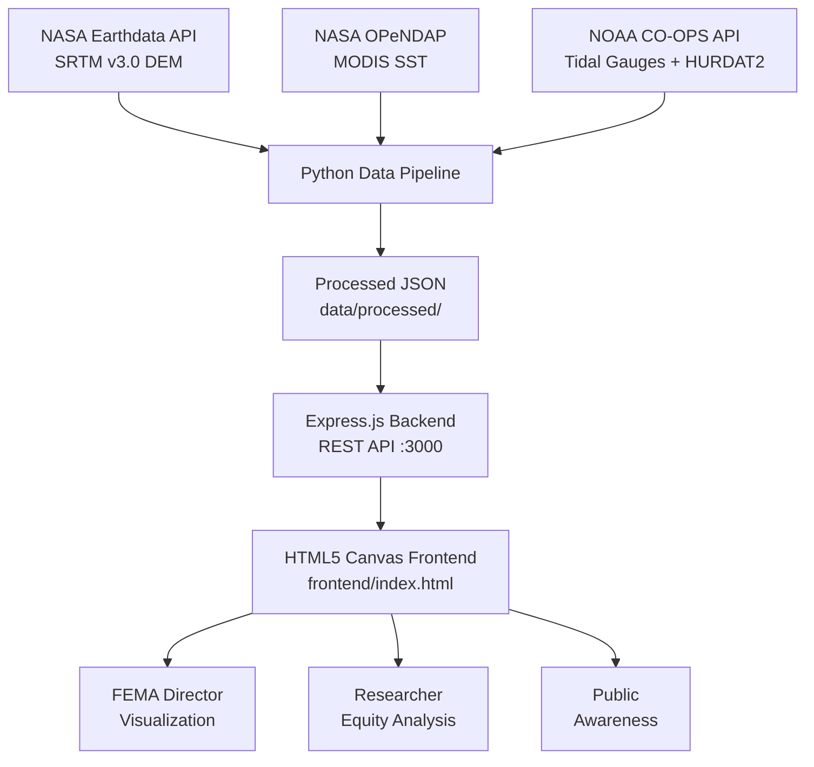
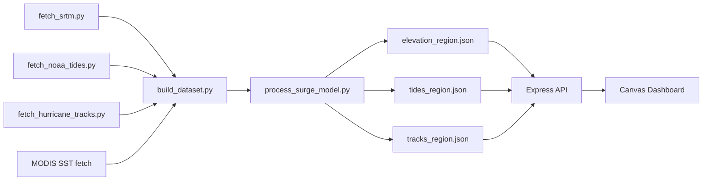

# TIDEWATCH — Project Overview

## What Is TIDEWATCH?

TIDEWATCH is an open-source coastal flood vulnerability platform that fuses
three authoritative geophysical datasets to compute storm surge inundation
risk at 30-meter resolution for six of the world's most exposed coastal regions.

> [!NOTE]
> TIDEWATCH is designed to be actionable for three audiences simultaneously:
> NASA Earth science reviewers, FEMA regional emergency managers, and
> environmental justice researchers.

---

## System Architecture

---

## Data Pipeline Flow

---

## Key Metrics by Region

| Region | FEI Score | Pop @ CAT5 | Benchmark |
|---|---|---|---|
| Gulf Coast | 187 | 2.1M | Katrina 2005 |
| Atlantic | 142 | 890K | Sandy 2012 |
| Florida | 156 | 1.4M | Ian 2022 |
| Pacific CA | 118 | 340K | 1983 ENSO |
| Caribbean | 201 | 680K | Maria 2017 |
| Bay of Bengal | **312** | **8.4M** | 1991 Cyclone |

> [!WARNING]
> The Bay of Bengal FEI score of 312 indicates that low-income communities
> face 3.1× the flood exposure of the regional average. This is the highest
> environmental injustice score in the TIDEWATCH dataset.

---

## Related Docs

- [[Methodology]] — Scientific basis for the inundation model
- [[Equity_Analysis]] — Flood Equity Index framework and findings
- [[NASA_Grant_Summary]] — ROSES-format project abstract
- [[FEMA_Brief]] — 2-page actionable policy brief
- [[Storm_Scenarios]] — Saffir-Simpson surge mapping
